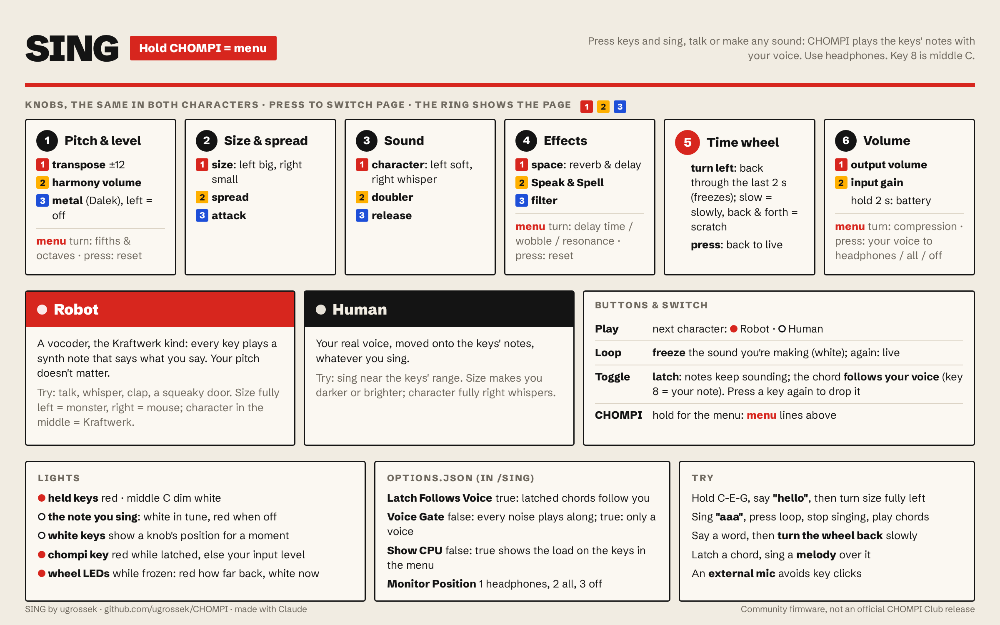

# SING

An instrument led by your voice, for CHOMPI. Press keys and sing, talk or make any sound: CHOMPI
plays the keys' notes with your voice. Simple enough for children: press a key, say something,
and it sings.



## Quick start

1. Plug in headphones (the built-in mic and speaker feed back).
2. Hold a key or two and say "hello". The **robot** sings it on those notes.
3. Press **play** for **Human**: your real voice on the keys' notes instead.
4. Flip the **toggle** to latch, hold a chord, let go, and sing a melody: the chord follows you.
5. Press **loop** to freeze the sound, then turn the **big wheel** to go back in time.

## Two characters

**Play** switches between them; its light shows which one is on.

- **Robot** (red): a vocoder, the Kraftwerk kind. Each key plays a buzzy synth note and your
  voice's words are imprinted on it. The pitch you sing doesn't matter, and talking, whispering,
  clapping or a squeaky door all work.
- **Human** (warm white): your real voice, shifted onto the keys' notes, whatever you sing. Sing roughly
  in the range of the keys for the most natural sound.

Key 8 is middle C (C4) in both. In Human, the key of the note you sing passes your voice
through unchanged: for children that's around the middle, for most grown-ups lower down.

## Buttons and switch

| | |
|---|---|
| **Play** | next character: Robot (red) / Human (warm white) |
| **Loop** | **freeze**: holds the sound you're making, so you can stop and keep playing chords with it (white while frozen); press again to go back to live |
| **Big wheel** | **time wheel**: turn left to go back through the last ~2 seconds (it freezes); slowly says it slowly, back and forth scratches. Press to go back to live |
| **Toggle switch** | **latch**: notes keep sounding after you let go. Press a sounding key again to drop it. While latched, the chord **follows your voice**: key 8 is your note, the other keys keep their distance from it |
| **Chompi key** | hold for the menu, below |

## Knobs

Press a knob to switch its page.

| Knob | Page 1 | Page 2 | Page 3 |
|---|---|---|---|
| **1** | **transpose**, ±12 semitones, continuous | **harmony volume** | **metal**: ring modulator (Dalek), off fully left |
| **2** | **size**: left big, right small | **spread** | **attack** |
| **3** | **character**: left soft, right whisper | **doubler** | **release** |
| **4** | **space**: reverb and delay | **Speak & Spell**: fewer samples and bits | **filter** |
| **5** | the big wheel: time wheel, above | | |
| **6** | **output volume** | **input gain** | |

The knobs are the same in both characters, latched or not. Page 2 is the ensemble (harmony
volume, spread, doubler), page 3 the shape (metal, attack, release). Size and character start in
the middle:

- **Size:** Robot moves its mouth (formants), from monster to mouse. Human tilts the tone,
  darker and fuller to the left, brighter and thinner to the right.
- **Character:** Robot's synth goes from a soft sine through the Kraftwerk buzz to noise. Human
  gets softer to the left and turns into a whisper to the right (the vocoder on noise).

Spread places the voices left and right; doubler thickens them with a chorus. Hold knob 6 for
two seconds to see the battery.

## Menu (hold the chompi key)

| | |
|---|---|
| Knob 1, turn | transpose in **fifths and octaves** (−12, −7, 0, +7, +12) |
| Knob 1, press | back to the default: transpose 0 / harmony volume / metal off |
| Knob 4, turn | the effect's detail: delay time, wobble (on Speak & Spell), filter resonance |
| Knob 4, press | reset all effects |
| Knob 6, turn | output compression |
| Knob 6, press | where your own voice goes: headphones (warm white), all outputs (red), off (very dim) |

The keys keep playing while the menu is open.

## Lights

Red and warm white, after Kraftwerk's *Die Mensch-Maschine*: red is the robot and what you
play, warm white the human and what's in tune.

- **Keys:** held keys red. The key of the note you're singing lights up too: warm white when in
  tune, red when off (a tuner). Middle C dim white. Turn a knob and the white keys show its
  position for a moment (transpose: from the middle outwards).
- **Knob rings** show the page in its colour, after the Bauhaus primaries: **page 1 red, page 2
  yellow, page 3 blue**, brighter as the control turns up. Knob 1 on transpose: warm white at 0,
  red either way. The bar on the white keys takes the colour of the page you're turning.
- **Big wheel's LEDs** while frozen: red for how far back, warm white for "now".
- **Chompi key:** red while latched, otherwise your input level; knob 6 shows the output level.
  Both meters are dim white when quiet, brighter as it gets louder, red when it's hot.
- **Battery** (hold knob 6): warm white full, dim white high, dim red medium, red low.

## Options

`options.json` in the `/SING` folder on the card, read at power-on. See [`OPTIONS.md`](OPTIONS.md).
SING's own:

- **Latch Follows Voice** (true): while latched, the chord follows your voice.
- **Voice Gate** (false): harmonies only while there's a voice or a loud enough sound. Off, every
  noise goes through, which is half the fun.
- **Show CPU** (false): in the menu, the white keys show the audio load.

Every start begins from the defaults; SING doesn't save knob settings.

## Tips

- **Use headphones.** The built-in mic and speaker feed back.
- **An external mic on the input jack** avoids key clicks; the built-in mic sits on the same board
  as the keys. Plugging into the jack switches to it.
- Knob 6, page 2 (input gain) sets how hot your voice goes in.
- Freeze a vowel ("aaa") and play chords with it; freeze a word and scratch it with the wheel.

## How it works

- **Robot** ([`Vocoder.h`](code/src/Vocoder.h)): a 16-band channel vocoder, 120 Hz to 7.5 kHz.
  Each key plays a band-limited sawtooth (with a sine and noise for the character knob); the
  voice's level per band shapes the same bands of the synth. Size moves the voice's bands against
  the synth's (formant shift). Freeze holds the band levels, smoothed over 25 ms; the time wheel
  reads them from a 2-second history.
- **Human** ([`Harmonizer.h`](code/src/Harmonizer.h)): each key runs the voice through its own
  WSOLA pitch shifter ([`PitchShifter.h`](code/src/PitchShifter.h)), by the distance from the
  sung note to the key's note.
- **Pitch** ([`PitchDetector.h`](code/src/PitchDetector.h)): YIN on the input, every 4 ms, 80 Hz
  to 1 kHz, computed in the main loop so it doesn't take time from the voices.
- **Human's freeze** ([`VoiceFreeze.h`](code/src/VoiceFreeze.h)): a 2.7-second recording of the
  voice; frozen, two overlapping grains, each a whole number of the voice's periods and lined up
  by cross-correlation, repeat the moment seamlessly.

The DSP parts have no libDaisy and are tested on a PC: [`code/test/`](code/test/) (pitch detector,
vocoder, voice freeze, freeze quality). Each builds with
`g++ -std=c++14 -O2 -I../src <name>_test.cpp`.

## Install

With the [multi-firmware launcher](https://github.com/sfaber02/CHOMPI/releases/latest) v1.1 or
later, send the `.bin` to a free slot from <https://ugrossek.github.io/CHOMPI/>. On a stock card,
put it in the card root as the only `.bin`, like any firmware update.

SING keeps `options.json` in a `/SING` folder on the card if there is one, otherwise in the card
root.

## Known limits

- Human: about 30–45 ms of delay on voices shifted up, and a little wobble when the voice moves
  fast. Robot follows the voice within a few milliseconds.
- While latched chords follow the voice, the robot uses the detected pitch: with noises it stays
  on the last sung note.
- Key clicks reach the built-in mic; an external mic avoids them.
- On some units the LEDs can be heard as a faint whine through the built-in mic.
- Tested on one unit.

## Building

Toolchain: GNU Arm Embedded 10.3-2021.10, as for TAPE. SING uses TAPE's prebuilt libraries
from `../../../chompi-tape/code/libs` rather than a copy (override with
`make CHOMPI_LIBS=/path/to/libs`):

```bash
cd code/src
PATH=/path/to/gcc-arm-none-eabi-10.3-2021.10/bin:$PATH make -j8
```

Output is `build/CHOMPI.bin`.

## Written with AI

SING was written together with Claude, Anthropic's AI assistant, and tested on one CHOMPI.
Unofficial, experimental software, provided as-is with no warranty (see
[`LICENSE`](../../LICENSE)); use it at your own risk.
